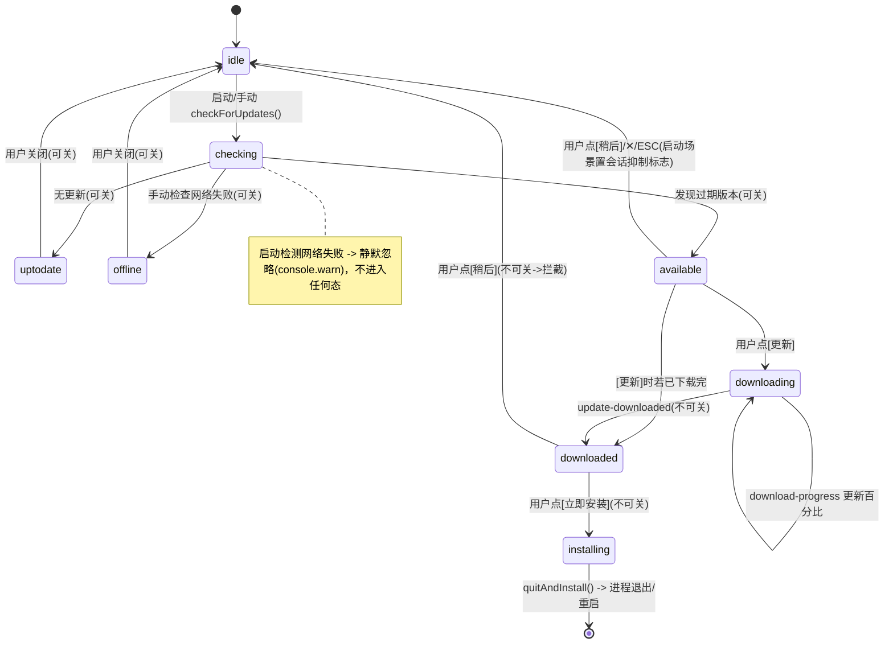
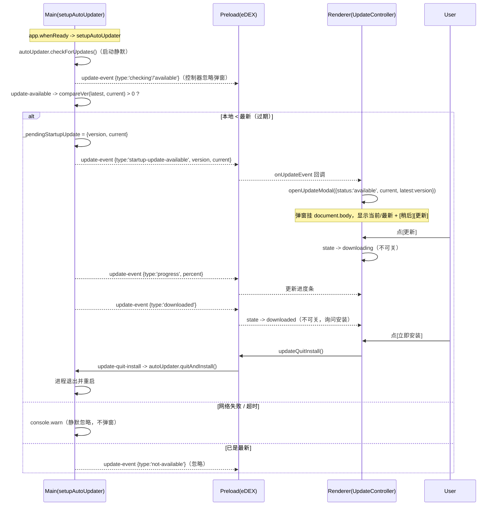
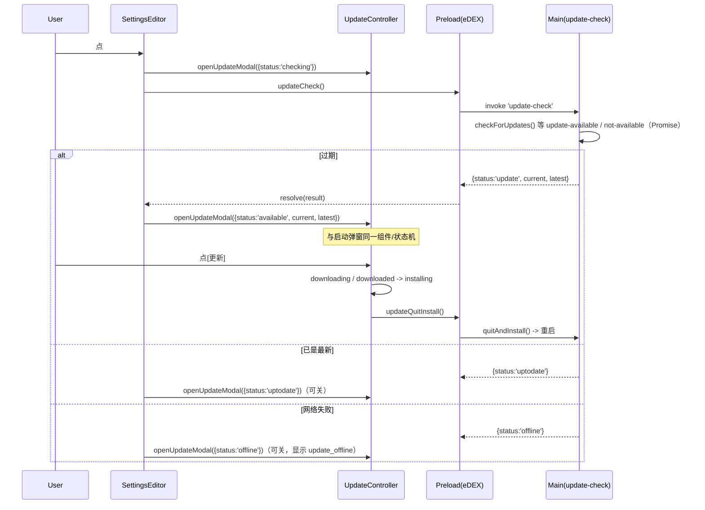
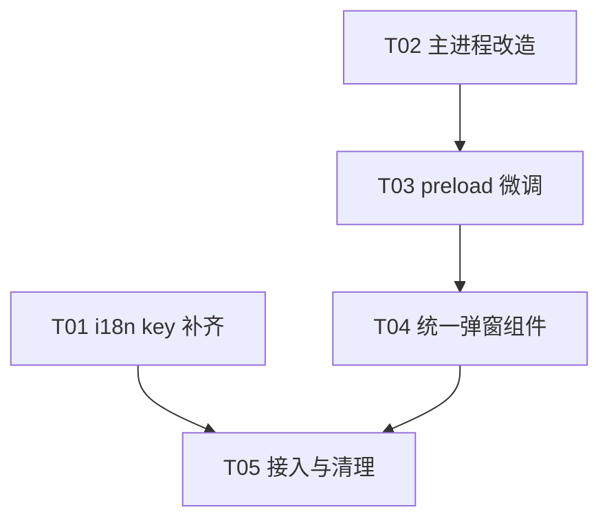

# 增量设计 + 任务分解 —— 检查更新流程增强（settings-update-v2）

| 项 | 内容 |
| --- | --- |
| 文档类型 | 增量设计文档（基于真实代码） |
| 项目 | eDEX-UI-Plus（Electron 桌面应用，当前版本 v1.1.0） |
| 技术栈 | Electron + electron-vite + electron-updater（**无新框架**），渲染进程 i18n 沿用 `renderer/locale.js` 的 `t(key)` |
| 设计语言 | 简体中文 |
| 架构师 | 高见远（software-architect） |
| 依据文件 | `docs/settings-update-v2/prd.md`、`renderer/modules/settingsEditor.js`、`main/index.js`、`preload/index.js`、`renderer/locale.js`、`renderer/languages/zh.json`、`renderer/languages/en.json`、`renderer/modules/updateChecker.js`、`renderer/main.js`、`renderer/css/main.css` |

---

## 1. 实现方案与框架选型

### 1.1 技术难点与决策

1. **双语文案（R1 / Q1-A）**：复用现有 `t(key)` + `window.__edexSettings.language` 机制，不新增任何 i18n 框架。补齐 `zh.json`/`en.json` 缺失 key。**关键排查结论**：`settingsEditor.js:258` 当前写 `t('check_update') || '检查更新'`，但 `locale.js:17` 的 `t(key)` 在 key 缺失时返回 key 本身（`l[key] || key`），故 `|| '检查更新'` 是**死代码**——key 缺失时按钮实际显示字面量 `check_update`。补 key 后 `t()` 直接返回正确翻译，fallback 不再触发，问题自然消失。
2. **启动独立弹窗（R3 / Q3）**：现有弹窗 `modalRoot = document.getElementById('settings-page')`（`settingsEditor.js:382`）绑定在设置页内，启动弹窗无法在设置页关闭时显示。方案：抽取**单一独立 overlay 组件** `src/renderer/modules/updateModal.js`，挂载到 `document.body`，由模块级单例 `UpdateController` 驱动；启动检测与设置按钮**共用同一状态机与同一组件**（`openUpdateModal(state)`）。
3. **不可关闭约束（R4）**：当状态为 `downloading / downloaded / installing` 时，隐藏/禁用 `✕` 关闭按钮，并用 `window` 捕获阶段 `keydown` 监听 `stopImmediatePropagation` 拦截 `ESC`（捕获阶段 `window` 监听先于 `document` 监听 `main.js:364`，可阻断设置页/菜单的 ESC 处理）。
4. **进度条（R5）**：复用全局 `.bar` 样式（`css/main.css:101` 已定义 `.bar > i`），`download-progress` 事件经 `update-event` 通道推送百分比。
5. **主进程改动（R7/R8）**：`autoInstallOnAppQuit` 改为 `false`；保留 `autoDownload=true`（后台下载无妨）；**移除下载完成即自动重启**的路径（当前该逻辑在渲染进程 `showUpdateReadyAndRestart()`，`settingsEditor.js:455`，400ms 后 `updateQuitInstall()`——整段删除）。安装仅由渲染进程在用户确认后显式调 `updateQuitInstall()`。
6. **启动弹窗触发（R2/R3）**：保留 `autoUpdater.checkForUpdates()` 启动静默检测；在 `update-available` 事件中取 `info.version` 与 `app.getVersion()` 经现有 `compareVer()`（按 Q5 仅比对 semver）比较，本地过低则 `sendUpdateEvent({type:'startup-update-available', version, current})` 推给渲染进程弹窗。
7. **竞态兜底（健壮性）**：主进程 `setupAutoUpdater` 在 `app.whenReady` 即触发检测，可能早于渲染进程订阅。方案：主进程把过期结果缓冲进 `_pendingStartupUpdate`，新增 `get-pending-update` IPC；渲染进程 `initUpdateListener()` 订阅后主动取一次缓冲值，保证启动弹窗不丢失。
8. **启动 vs 手动失败表现（R9 / Q2）**：启动检测失败 → 主进程仅 `console.warn`，**不推送任何弹窗事件**；手动「检查更新」失败 → `update-check` IPC 返回 `{status:'offline'}`，渲染进程弹**可关闭**失败提示（`t('update_offline')`）。`update-event` 通道上的 `error` 事件在控制器内**忽略用于弹窗**（避免重复打扰），手动失败由 `updateCheck()` 返回值驱动。
9. **退订时机（Q3）**：订阅生命周期收敛到 `updateModal.js` 的单例 `initUpdateListener()`，在 `main.js` 启动阶段调用一次、应用生命周期内常驻；移除 `settingsEditor.js` 的 `_updateUnsub` 机制。无每次开/关设置的重复订阅，彻底避免监听器泄漏。

### 1.2 架构模式

- **渲染进程**：模块级单例控制器（`UpdateController`）+ 纯函数式 DOM 渲染（`openUpdateModal` 幂等重渲染），不引入框架。
- **主进程**：事件驱动（electron-updater 事件 → `update-event` IPC 通道）+ 请求/响应 IPC（`update-check` / `get-pending-update` / `update-quit-install`）。
- **preload**：白名单桥（`eDEX.*`），新增 `getPendingUpdate`，`onUpdateEvent` 返回退订函数（已具备）。

---

## 2. 文件列表（标注 新增 / 修改）

| 相对路径 | 状态 | 改动要点 |
| --- | --- | --- |
| `src/renderer/languages/zh.json` | 修改 | 新增 14~15 个更新相关 i18n key（见 §7） |
| `src/renderer/languages/en.json` | 修改 | 同上，英文文案 |
| `src/main/index.js` | 修改 | `autoInstallOnAppQuit=false`；`update-available` 内 semver 比较并推送 `startup-update-available` + 缓冲 `_pendingStartupUpdate`；新增 `get-pending-update` IPC；`update-check` 改为 Promise 等待结果；`error` 事件 `console.warn`；保留后台 `checkForUpdates()` |
| `src/preload/index.js` | 修改 | 确认 `getAppVersion/updateCheck/updateQuitInstall/onUpdateEvent` 足够；新增 `getPendingUpdate` 桥接 `get-pending-update` IPC |
| `src/renderer/modules/updateModal.js` | **新增** | 统一更新状态机 + 独立 overlay 组件 + `openUpdateModal` + `initUpdateListener` + ESC 拦截 + 进度条 + 不可关闭约束 + 退订 |
| `src/renderer/main.js` | 修改 | 移除 legacy `checkForUpdates()`（第 158 行）与 `updateChecker` 导入，改为调用 `initUpdateListener()`（在 `startFadeIn` 早期、ESC 监听注册前） |
| `src/renderer/modules/settingsEditor.js` | 修改 | 删除内联 `renderUpdateModal/applyUpdateEvent/showUpdateReadyAndRestart` 与 `_updateUnsub`；按钮文案改为 `t('check_update')`（去掉坏 fallback）；点击调 `openUpdateModal({status:'checking'})` + `window.eDEX.updateCheck()` |
| `src/renderer/modules/updateChecker.js` | 废弃/删除（非阻塞） | 不再被 `main.js` 调用（其 `checkUpdate()` 走旧 GitHub API，与 electron-updater 不统一）；建议删除，或保留但无引用 |

> 说明：`preload/index.js`/`updateModal.js` 设计上保持与现有 `out/` 构建产物解耦，仅改 `src/` 源码。

---

## 3. 数据结构与接口

### 3.1 统一更新状态机

状态集合：`idle / checking / uptodate / offline / available / downloading / downloaded / installing`

| 状态 | 含义 | 可关闭？（R4） | 触发来源 |
| --- | --- | --- | --- |
| `idle` | 初始/关闭 | — | — |
| `checking` | 检查中（手动按钮瞬时显示） | 可关 | 手动点击 |
| `uptodate` | 已是最新 | 可关 | `update-check` 返回 uptodate |
| `offline` | 网络失败（仅手动） | 可关 | `update-check` 返回 offline |
| `available` | 发现新版本 | 可关 | `startup-update-available` 事件 / `update-check` 返回 update |
| `downloading` | 下载中（进度条） | **不可关** | 用户点[更新] + `progress` 事件 |
| `downloaded` | 下载完成，询问安装 | **不可关** | `update-downloaded` 事件 |
| `installing` | 安装中 | **不可关** | 用户点[立即安装] 后调用 `updateQuitInstall()` |



### 3.2 IPC 事件 Payload 表

**主进程 → 渲染进程（通道 `update-event`，经 `sendUpdateEvent`）**

| `type` | payload | 渲染端处理 |
| --- | --- | --- |
| `checking` | `{}` | 忽略（静默） |
| `available` | `{ version }` | 仅记录版本，不弹窗（弹窗由 `startup-update-available` 或手动 return 驱动，避免重复） |
| `not-available` | `{}` | 忽略 |
| `progress` | `{ percent:number }` | 若弹窗在 `available/downloading` 态 → 更新进度条、置 `downloading` |
| `downloaded` | `{}` | 若弹窗在 `available/downloading` 且未被会话抑制 → 转 `downloaded`（询问安装）；若弹窗已关且会话未抑制 → 置内部 `downloaded=true` |
| `error` | `{ message }` | 忽略用于弹窗（启动静默；手动由 `update-check` 返回值处理） |
| `startup-update-available` | `{ version, current }` | 若未被会话抑制 → `openUpdateModal({status:'available', current, latest:version})` |

**渲染进程 → 主进程（IPC `invoke`）**

| IPC | 入参 | 返回 | 说明 |
| --- | --- | --- | --- |
| `get-app-version` | — | `string` | 当前版本（`app.getVersion()`） |
| `update-check` | — | `{ status:'update'|'uptodate'|'offline'|'unconfigured', current, latest?, progress?, downloaded? }` | 手动检查；packaged 用 Promise 等待 `update-available`/`update-not-available` 真实结果 |
| `update-quit-install` | — | — | `autoUpdater.quitAndInstall()` |
| `get-pending-update` | — | `{ version, current } \| null` | 取启动缓冲的过期信息（竞态兜底） |
| `check-update` | — | （legacy，保留） | 旧 GitHub API，dev 用，本次不再被启动路径调用 |

**preload `eDEX` 暴露 API（确认/新增）**

| API | 现状 | 说明 |
| --- | --- | --- |
| `getAppVersion()` | 已有 | 无需改 |
| `updateCheck()` | 已有 | 无需改 |
| `updateQuitInstall()` | 已有 | 无需改 |
| `onUpdateEvent(cb)` → 退订函数 | 已有（返回 removeListener） | 无需改 |
| `getPendingUpdate()` | **新增** | 桥接 `get-pending-update` IPC |

### 3.3 模块/类关系（Mermaid classDiagram）

```mermaid
classDiagram
    class UpdateController {
        - state: UpdateState
        - data: {current, latest, progress, downloaded}
        - _unsub: Function
        - _startupDismissed: boolean
        + openUpdateModal(partial)
        + initUpdateListener()
        - _handleEvent(payload)
        - _render()
        - _closeModal()
        - _onEsc(e)
        - _requestInstall()
    }
    class MainAutoUpdater {
        - _pendingStartupUpdate
        + setupAutoUpdater(win)
        + handleUpdateCheck()
        + handleGetPendingUpdate()
    }
    class PreloadBridge {
        + getAppVersion()
        + updateCheck()
        + updateQuitInstall()
        + onUpdateEvent(cb) 退订
        + getPendingUpdate() 新增
    }
    class SettingsEditor {
        + openSettings()
        + closeSettings()
    }
    class i18n {
        + t(key)
    }
    UpdateController ..> PreloadBridge : onUpdateEvent / updateCheck / updateQuitInstall / getPendingUpdate
    UpdateController ..> i18n : t(key)
    MainAutoUpdater ..> PreloadBridge : invoke IPC
    SettingsEditor ..> UpdateController : openUpdateModal / 启动 initUpdateListener
    MainAutoUpdater ..> UpdateController : update-event(startup-update-available...)
```

---

## 4. 程序调用流程（时序图）

### 4.1 启动检测路径



### 4.2 手动点击路径（设置页按钮）



---

## 5. Anything UNCLEAR（待明确事项）

1. **启动检测超时阈值（PRD §3.2-D 建议 8s）**：electron-updater 的 `checkForUpdates()` 无内置超时；要精确 8s 静默忽略需额外 `AbortController`/`setTimeout` 包裹，但当前主进程 `update-available` 失败仅是“不弹窗”，已达 Q2 静默要求。建议：先不实现硬性超时，仅以 `console.warn` 兜底；若需严格 8s 再迭代。
2. **`autoDownload=true` 与「点[更新]才开始下载」的语义差异**：因 `autoDownload=true`，检测到期后会**自动后台下载**，用户点[更新]时可能已在下载中或已完成。设计已兼容（点[更新]时若内部 `downloaded=true` 直接转 `downloaded` 询问安装）。若产品希望“严格点击后才下载”，需将 `autoDownload` 改为 `false` 并在点[更新]时调 `autoUpdater.downloadUpdate()`——此为后续可选项，本版保持 `autoDownload=true`（符合主理人决策「后台下载无妨」）。
3. **dev 环境更新行为**：dev 下 `setupAutoUpdater` 提前 `return`（`main/index.js:473`），`update-check` 走旧 GitHub API 分支。新逻辑主要在打包环境生效；dev 验证可临时放开或仅验证 `update-check` 返回值与弹窗组件。
4. **`updateChecker.js` 处置**：建议删除（与 electron-updater 不统一），但属非阻塞清理项；若担心影响其他引用可暂时保留空文件。
5. **多窗口/多实例**：当前为单 `BrowserWindow`，单例控制器足够；若未来多窗口需改为按 `win` 分发。

---

## 6. 依赖包列表

| 包 | 版本/状态 | 说明 |
| --- | --- | --- |
| `electron-updater` | 已安装 | 更新核心，**无需新增**；沿用 `autoUpdater` |
| `electron` | 已安装 | 无需新增 |
| `augmented-ui` | 已安装（`main.js:2` 导入 css） | 弹窗视觉风格复用，无需新增 |
| `semver`（npm 包） | **不引入** | 复用现有 `compareVer()`（`main/index.js:438`）即可满足 Q5「仅比对 semver」 |
| 任何其他 UI/状态库 | 不引入 | 纯模块单例 + 函数式渲染，保持轻量 |

---

## 7. 任务列表（有序、含依赖、按实现顺序）

> 每个任务标注：涉及文件 + 验收点。依赖用前置任务 ID 表示。

### T01 — i18n 双语 key 补齐
- **涉及文件**：`src/renderer/languages/zh.json`（修改）、`src/renderer/languages/en.json`（修改）
- **依赖**：无
- **内容**：新增以下 key（zh/en 成对）：

| Key | 中文（zh） | 英文（en） |
| --- | --- | --- |
| `check_update` | 检查更新 | Check for Updates |
| `update_checking` | 正在检查更新… | Checking for updates… |
| `update_found` | 发现新版本 | New version available |
| `update_current` | 当前版本 | Current |
| `update_latest` | 最新版本 | Latest |
| `update_now` | 更新 | Update |
| `update_later` | 稍后 | Later |
| `update_downloading` | 正在下载更新 | Downloading update |
| `update_downloaded` | 更新已下载完成 | Update downloaded |
| `update_install_prompt` | 下载完成，是否立即安装？ | Download complete. Install now? |
| `update_install_now` | 立即安装并重启 | Install & Restart |
| `update_installing` | 正在安装更新… | Installing update… |
| `update_uptodate` | 已是最新版本 | You're up to date |
| `update_offline` | 无法连接更新服务器，请稍后重试 | Can't reach update server. Try later |
| `update_error` | 检查更新失败 | Update check failed |

- **验收点**：两个 JSON 均含上表全部 key，JSON 语法合法；`t('check_update')` 在 zh/en 下分别返回「检查更新 / Check for Updates」。

### T02 — 主进程更新逻辑改造
- **涉及文件**：`src/main/index.js`（修改）
- **依赖**：无（与 T01 可并行）
- **内容**：
  1. `setupAutoUpdater`：`autoUpdater.autoInstallOnAppQuit = true` → **`false`**（第 478 行）。
  2. `update-available` 处理：取 `info.version` 与 `app.getVersion()` 经 `compareVer()` 比较；若 `compareVer(latest, current) > 0`，设 `_pendingStartupUpdate = { version: latest, current }` 并 `sendUpdateEvent(win, { type:'startup-update-available', version: latest, current })`。
  3. 新增模块变量 `_pendingStartupUpdate = null` 与 IPC `ipcMain.handle('get-pending-update', () => _pendingStartupUpdate)`。
  4. `update-check` IPC：packaged 分支改为 `new Promise` 等待 `update-available`/`update-not-available`/`error` 真实结果后再 resolve（用 `autoUpdater.once` + `cleanup`），返回 `{ status, current, latest, progress, downloaded }`。
  5. `error` 事件：`console.warn('[updater]', message)`（保持静默语义），仍 `sendUpdateEvent({type:'error'})` 但渲染端忽略弹窗。
  6. 保留 `autoUpdater.checkForUpdates()` 启动调用与 `autoDownload = true`。
- **验收点**：启动过期时渲染端能收到 `startup-update-available`；`get-pending-update` 返回缓冲值；`update-check` 在 packaged 下返回正确 `status`；`autoInstallOnAppQuit === false`。

### T03 — preload 桥接微调
- **涉及文件**：`src/preload/index.js`（修改）
- **依赖**：T02（需对应 `get-pending-update` IPC）
- **内容**：确认 `getAppVersion / updateCheck / updateQuitInstall / onUpdateEvent` 足够；新增 `getPendingUpdate: () => ipcRenderer.invoke('get-pending-update')`。
- **验收点**：`window.eDEX.getPendingUpdate()` 返回与 `_pendingStartupUpdate` 一致的值（或 null）。

### T04 — 统一弹窗组件（新增）
- **涉及文件**：`src/renderer/modules/updateModal.js`（新增）
- **依赖**：T02、T03（消费 `update-event` 通道、`updateCheck`、`updateQuitInstall`、`getPendingUpdate`）
- **内容**：实现 `UpdateController` 单例：
  1. `openUpdateModal(partial)`：幂等合并 `data`、设置 `state`、调用 `_render()`（overlay 挂 `document.body`，ID `#edex-update-modal`）。
  2. `initUpdateListener()`：调用 `window.eDEX.onUpdateEvent(_handleEvent)` 一次（应用生命周期常驻）；随后调 `getPendingUpdate()` 取缓冲，若非空且未 `dismissed` → `openUpdateModal({status:'available', ...})`。
  3. `_handleEvent(payload)`：按 §3.2 通道类型机转状态（忽略 `checking/not-available/available/error` 用于弹窗；`progress`→更新进度；`downloaded`→转 `downloaded` 或置内部标记；`startup-update-available`→开弹窗）。
  4. `_render()`：根据 `state` 渲染标题(`t('check_update')`)、当前/最新(`t('update_current'/'update_latest')`)、主体（提示/进度条/按钮）。进度条复用 `.bar`：`<div class="bar"><i style="width:N%"></i></div>` + `t('update_downloading') + N%`。
  5. **不可关闭约束（R4）**：`state ∈ {downloading, downloaded, installing}` 时隐藏/禁用 `✕` 按钮。
  6. **ESC 拦截**：`window.addEventListener('keydown', _onEsc, true)`——捕获阶段、`e.key==='Escape'` 且弹窗存在时 `e.preventDefault(); e.stopImmediatePropagation();` 再按 `state` 决定是否 `_closeModal()`（可关态才关）。
  7. 按钮行为：`available`→[稍后]`_closeModal()`+置 `_startupDismissed=true`；[更新]→若 `downloaded` 转 `downloaded` 否则转 `downloading`。`downloaded`→[立即安装]→`_requestInstall()`。
  8. `_requestInstall()`：`state='installing'` 重渲染 → `window.eDEX.updateQuitInstall()`。
- **验收点**：弹窗挂 `document.body`（非 `#settings-page`）；`downloading/downloaded/installing` 下 `✕` 与 `ESC` 均失效；进度条随 `progress` 事件增长；单一订阅、无泄漏。

### T05 — 接入与清理
- **涉及文件**：`src/renderer/main.js`（修改）、`src/renderer/modules/settingsEditor.js`（修改）、`src/renderer/modules/updateChecker.js`（废弃/删除，非阻塞）
- **依赖**：T04（且间接依赖 T01 文案）
- **内容**：
  1. `main.js`：移除 `import { checkForUpdates } from './modules/updateChecker.js'` 与 `startFadeIn` 内 `checkForUpdates()`（第 158 行）；改为 `import { initUpdateListener } from './modules/updateModal.js'`，在 `startFadeIn` 早期（ESC 监听注册**前**）调用 `initUpdateListener()`。
  2. `settingsEditor.js`：删除 `renderUpdateModal / applyUpdateEvent / showUpdateReadyAndRestart` 及 `_updateUnsub` 变量；按钮改为 `t('check_update')`（**去掉 `|| '检查更新'` 坏 fallback**）；点击处理改为 `openUpdateModal({status:'checking'})` 后 `const r = await window.eDEX.updateCheck()` 再 `openUpdateModal({status:r.status, current:r.current, latest:r.latest})`；顶部版本号逻辑保留。
  3. `updateChecker.js`：移出引用后可删除（保留不报错亦可）。
- **验收点**：启动弹窗与手动按钮走同一 `updateModal.js` 组件；关闭设置页不影响启动弹窗显示；手动与启动版本号/状态一致（R6）；无 `onUpdateEvent` 监听器泄漏；按钮中英文正确（R1）。

---

## 8. 共享知识（跨文件约定）

1. **semver 比较位置**：统一放在主进程 `compareVer()`（`main/index.js:438`），渲染进程不做版本比较，只接收比较结论。`update-available` 事件内完成比较后，仅推送 `latest` 与 `current` 供展示。
2. **ESC 拦截约定**：更新弹窗存在期间，ESC 处理**完全由 `updateModal.js` 的 `window` 捕获监听接管**（`stopImmediatePropagation` 阻断 `main.js:364` 的 document 监听）。其他模块（设置页、菜单）无需改动 ESC 逻辑，弹窗消失后 ESC 行为自动恢复。
3. **退订约定**：`onUpdateEvent` 订阅只在 `initUpdateListener()` 发生一次、应用生命周期常驻；不再有“打开/关闭设置页”维度的订阅与退订（`settingsEditor.js` 的 `_updateUnsub` 机制删除）。避免监听器泄漏。
4. **不可关闭三态**：`downloading / downloaded / installing` 为硬约束态，`✕` 与 `ESC` 统一失效；其他态（含 `available`）用户可随时关闭。
5. **启动静默**：主进程对启动检测的失败/超时只 `console.warn`，**绝不**经 `update-event` 弹出 `startup-update-available`；手动失败由 `update-check` 返回值驱动可关闭弹窗。
6. **进度条样式**：复用全局 `.bar`（`css/main.css:101`），弹窗内直接 `<div class="bar"><i style="width:N%"></i></div>`，无需重复定义。
7. **事件通道单一**：主→渲统一走 `update-event` 通道 + `type` 判别；新增类型须同步更新 `preload.onUpdateEvent` 消费者（控制器 `_handleEvent`）的白名单。
8. **i18n 兜底规则**：`t(key)` 缺失返回 key 本身；新增 UI 文案必须成对写入 `zh.json`/`en.json`，不得依赖 `|| '中文'` 兜底（历史坏写法已确认失效）。

---

## 9. 任务依赖图


